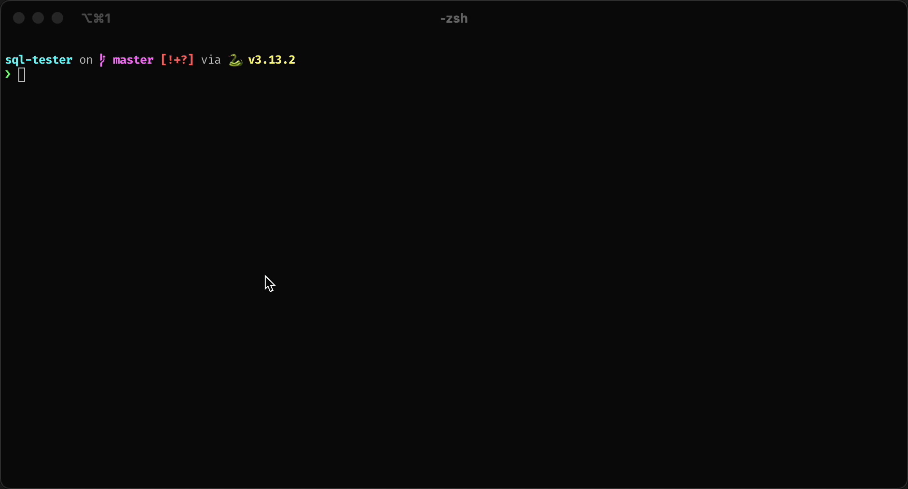

# DBS Assignment Format Tester

This project is a utility for evaluating, checking, and reporting on SQL assignments. It reads an assignment definition
(in JSON format) and verifies that each required file in a submission ZIP archive conforms to the expected Jinja2
template syntax.



## Installation

### Using a Virtual Environment

Clone repository:

```shell
# Clone repository
git clone git@github.com:FIIT-Databases/sql-tester.git sql-tester
cd sql-tester
```

Create and Activate a Virtual Environment:

```shell
python -m venv .venv
source .venv/bin/activate
```

Install Dependencies:

```shell
pip install -r requirements.txt
```

### Using Docker

A Dockerfile is provided for building a containerized environment.

Download Docker image:

```shell
docker pull ghcr.io/fiit-databases/sql-tester:master
```

Run the Docker Container:

```shell
docker run -it --rm ghcr.io/fiit-databases/sql-tester:master python -m dbs_tester -f data/2025-01/xbond.zip
```

The `-v "$(pwd)/data/2025-01/xbond.zip:/usr/src/app/data/2025-01/xbond.zip"` flag mounts your assignment zip into the
container, ensuring your zip file is accessible within the container.

## Usage

Run the utility from the command line by specifying the path to the submission ZIP file:

```shell
python -m dbs_tester -f data/2025-01/xdent.zip
```

Options:
- `-f` or `--file`: Path to the submission ZIP file (required)
- `-d` or `--definition`: Path to the assignment definition JSON file. Defaults to `data/2025-01/definition.json`.
- `-h` or `--help`: Prints help

---


Made with ❤️ and ☕️ FIIT STU (c) 2025
